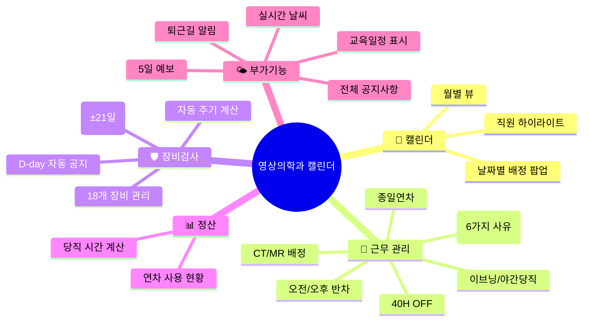

# 🏥 영상의학과 캘린더

> [!info] 한 줄 요약
> 해동병원 영상의학과 직원들의 **당직·연차·장비검사** 일정을 관리하는 **모바일 우선 PWA 웹앱**

## 📌 핵심 정보

| 항목 | 내용 |
|------|------|
| **GitHub** | [ralph8211-blip/radiology-calendar](https://github.com/ralph8211-blip/radiology-calendar) |
| **배포 URL** | [radiology-calendar.vercel.app](https://radiology-calendar.vercel.app) |
| **기술 스택** | Vanilla HTML/CSS/JS + Firebase Firestore |
| **인증** | PIN 코드 (`6633`) → localStorage 기반 |
| **데이터 동기화** | Firebase 익명인증 + Firestore 실시간 동기화 |
| **대상 사용자** | 해동병원 영상의학과 직원 13명 |

## 🗂️ 문서 구조

```
docs/
├── 00 - 프로젝트 개요.md          ← 지금 보고 있는 문서
├── 01 - 아키텍처와 기술스택.md     ← 기술 구조 상세
├── 02 - 직원 데이터.md            ← 13명 직원 정보
├── 03 - 근무 배정 시스템.md        ← 당직/연차/대휴 로직
├── 04 - 장비검사 일정.md           ← 18개 장비 검사 사이클
├── 05 - 교육일정 데이터.md         ← 보수교육/학술대회
├── 06 - 공휴일과 달력 로직.md      ← 공휴일 + 렌더링 방식
├── 07 - Firebase 설정.md          ← Firestore 구조 + 인증
├── 08 - 날씨 기능.md              ← OpenWeatherMap 연동
└── 09 - UI 컴포넌트 가이드.md      ← 주요 UI 요소 정리
```

## 🧩 주요 기능 맵



## 🔗 관련 문서

- [[01 - 아키텍처와 기술스택]]
- [[02 - 직원 데이터]]
- [[03 - 근무 배정 시스템]]
- [[04 - 장비검사 일정]]
- [[07 - Firebase 설정]]

## 📝 메모

- `index.html`이 메인 파일 (모든 HTML/CSS/JS 인라인)
- `app.js`는 이전 버전의 전체 앱 (별도 HTML 포함, 레거시)
- `style.css`는 외부 스타일시트이나, 현재 `index.html` 내부 `<style>` 태그가 실제 사용됨
- Vercel로 정적 배포 (빌드 과정 없음)
