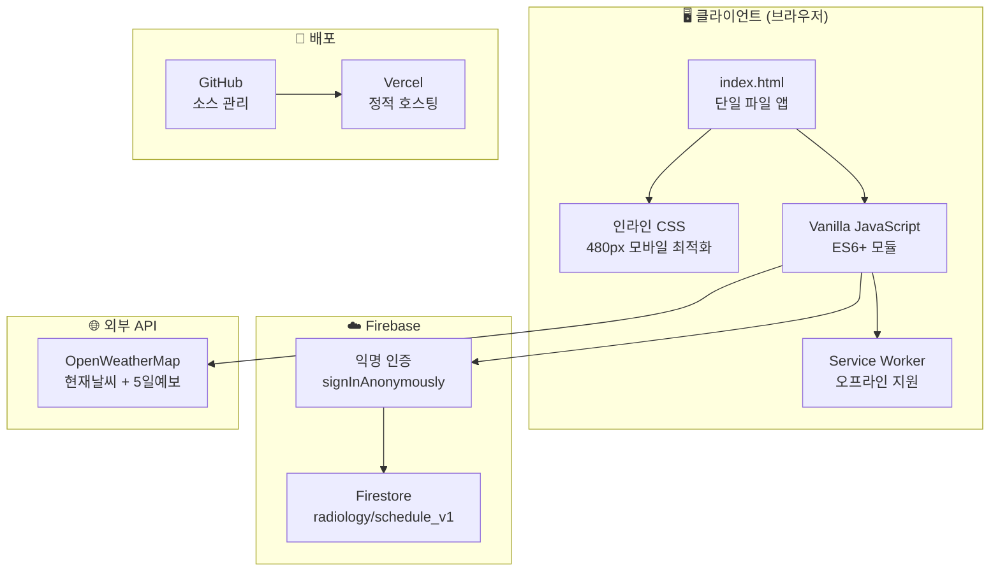
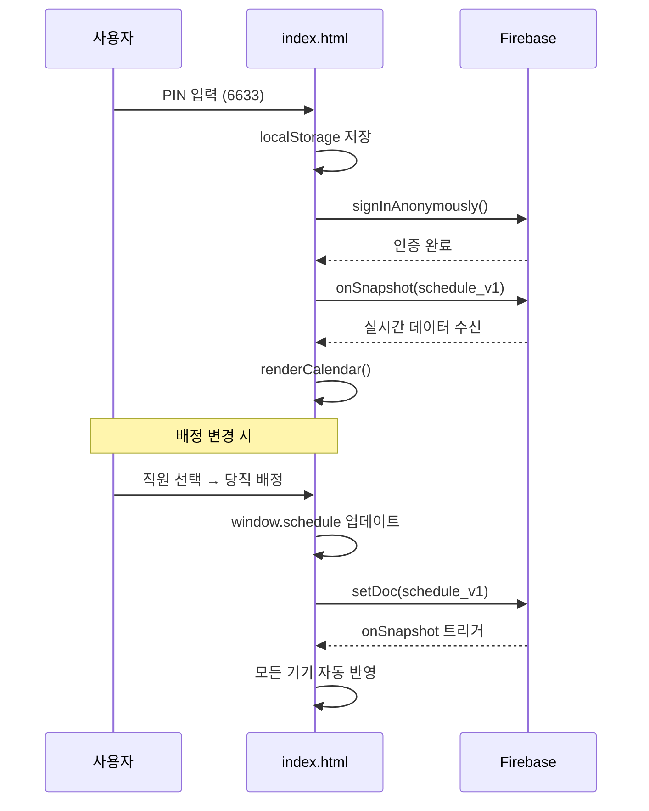

# 🏗️ 아키텍처와 기술스택

> [!note] 핵심 설계 철학
> **빌드 과정 없이** 단일 HTML 파일로 모든 기능을 구현. React/Vue 같은 프레임워크 없이 바닐라 JS만으로 동작.

## 파일 구조

```
radiology-calendar/
├── index.html          ← 메인 앱 (HTML + CSS + JS 모두 포함, 1651줄)
├── app.js              ← 이전 버전 (레거시, 사용 안 함)
├── style.css           ← 외부 CSS (현재 미사용, index.html 내부 style 사용)
├── manifest.json       ← PWA 매니페스트
├── service-worker.js   ← 오프라인 캐싱
├── firestore.rules     ← Firestore 보안 규칙
├── verification_report.md ← 검증 리포트
└── docs/               ← 옵시디언 문서 (이 폴더)
```

## 기술 스택 다이어그램



## 데이터 흐름



## 핵심 설계 포인트

### 1. 단일 파일 아키텍처
- `index.html` 하나에 **HTML + CSS + JS** 전부 포함
- 빌드 도구 불필요 → Vercel에서 그대로 서빙
- 장점: 배포 극도로 단순 / 단점: 파일이 1651줄로 비대

### 2. Firestore 단일 문서 전략
- `radiology` 컬렉션 → `schedule_v1` 문서 **하나**에 모든 데이터 저장
- 키: `"2026-04-05"` 형식의 날짜 문자열
- 값: `{ctmr: "종", night: "이승남", vacation: "동"}` 형태
- ⚠️ Firestore 문서 1MB 한도 주의 (현재는 충분)

### 3. 모바일 우선 설계
- `max-width: 480px` 기준
- 터치 최적화: `-webkit-tap-highlight-color: transparent`
- PWA 지원: 홈 화면 추가 가능
- `user-scalable=no`: 확대/축소 방지

### 4. 익명 인증 + PIN 이중 보안
- Firebase 익명 인증 → Firestore 접근 가능
- PIN 코드 → UI 접근 제어 (localStorage)
- 두 레이어가 독립적으로 동작

## CSS 디자인 시스템

| 변수명 | 값 | 용도 |
|--------|-----|------|
| `--navy` | `#1a237e` | 네비게이션, 로그인 배경 |
| `--indigo-600` | `#4f46e5` | 선택/액티브 상태 |
| `--rose-500` | `#f43f5e` | 일요일, 삭제 버튼 |
| `--purple-600` | `#9333ea` | 연차 배지 |
| `--emerald-600` | `#059669` | 대휴 배지 |
| `--amber-500` | `#f59e0b` | 메모, 이브닝 |
| `--teal-600` | `#0d9488` | CT/MR |

## 관련 문서

- [[00 - 프로젝트 개요]]
- [[07 - Firebase 설정]]
- [[09 - UI 컴포넌트 가이드]]
