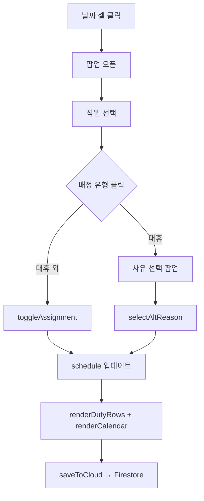

# ⏰ 근무 배정 시스템

> [!info] 소스 위치
> `index.html` 885~894줄 `DUTY_ROWS`, 1223~1320줄 배정/제거 로직

## 배정 유형 8가지

| ID | 라벨 | 색상 | 캘린더 표시 | 이름 방식 | 연차 차감 |
|----|------|------|------------|-----------|-----------|
| `half_am` | 오전반차 | 🟠 주황 | `☀종` | 이니셜 | **0.5일** |
| `half_pm` | 오후반차 | 🔵 파랑 | `🌙종` | 이니셜 | **0.5일** |
| `off40` | 40H OFF | 🔴 로즈(평일) / 💜 남색(토) | `40:종` / `종` | 이니셜 | 없음 |
| `vacation` | 종일연차 | 💜 보라 | `🏝종` | 이니셜 | **1일** |
| `alt_leave` | 대휴(차감X) | 💚 에메랄드 | `🌿종` | 이니셜 | 없음 |
| `ctmr` | CT / MR | 🩵 틸 | 배경 워터마크 | 이니셜 | 없음 |
| `evening` | 이브닝 | 🟡 앰버 | 하단 태그 | **풀네임** | 없음 |
| `night` | 야간당직 | 🟣 인디고 | 하단 태그 | **풀네임** | 없음 |

## 대휴 사유 6가지

대휴(`alt_leave`)는 배정 시 사유 선택 팝업이 뜸:

| 코드 | 표시 | 아이콘 | 배지 색상 |
|------|------|--------|-----------|
| `rest` | 대휴 | 🌿 | 초록 테두리 |
| `reserve` | 예비군훈련 | 🪖 | 파랑 테두리 |
| `event` | 경조사 | 💐 | 핑크 테두리 |
| `public` | 공가 | 🏛 | 노랑 테두리 |
| `half-am` | 반일대휴(오전) | ☀️ | 보라 테두리 |
| `half-pm` | 반일대휴(오후) | 🌙 | 핑크 테두리 |

### 대휴 저장 형식

```
alt_leave: "rest:종 reserve:승 event:동"
```

콜론 앞이 사유, 뒤가 이니셜.

## 배정 흐름



## 하이라이트 시스템

직원을 선택하면 캘린더에서 해당 직원의 일정이 색으로 하이라이트됨:

| 상황 | 하이라이트 색상 |
|------|----------------|
| 야간당직 / 이브닝 배정 | 🔵 파란색 반투명 |
| 종일연차 / 토요일 40H OFF | 🔴 빨간색 반투명 |
| 오전반차 | 🔴 상단 절반만 빨강 |
| 오후반차 / 평일 40H OFF | 🔴 하단 절반만 빨강 |
| 대휴 | 💚 초록색 반투명 |
| CT/MR | 배경에 큰 "CT" 또는 "CT·MR" 워터마크 |
| 해당 없음 | ⬜ 흐릿하게 dimmed (opacity: 0.12) |

## 당직 시간 계산 (정산)

> [!warning] 복잡한 계산 로직
> 요일과 공휴일 여부에 따라 시간이 다르게 계산됨

### 야간당직 시간

| 조건 | 시간 |
|------|------|
| 공휴일 / 일요일 | 14.5h |
| 토요일 | 16.5h |
| 평일 → 다음날 공휴일 (월요일) | 10.5h |
| 평일 → 다음날 공휴일 (기타) | 12h |
| 금요일 | 8h |
| 월요일 | 3h |
| 기타 평일 | 4.5h |

### 이브닝 시간

| 조건 | 시간 |
|------|------|
| 공휴일 | 12h |
| 토요일 | 6h |

## Firestore 데이터 예시

```json
{
  "2026-04-05": {
    "ctmr": "종",
    "evening": "이승남",
    "night": "김현석",
    "vacation": "동",
    "half_am": "선",
    "off40": "봉지진조",
    "alt_leave": "rest:승 event:강",
    "memo": "MRI 점검 예정"
  }
}
```

## 관련 문서

- [[02 - 직원 데이터]]
- [[06 - 공휴일과 달력 로직]]
- [[07 - Firebase 설정]]
