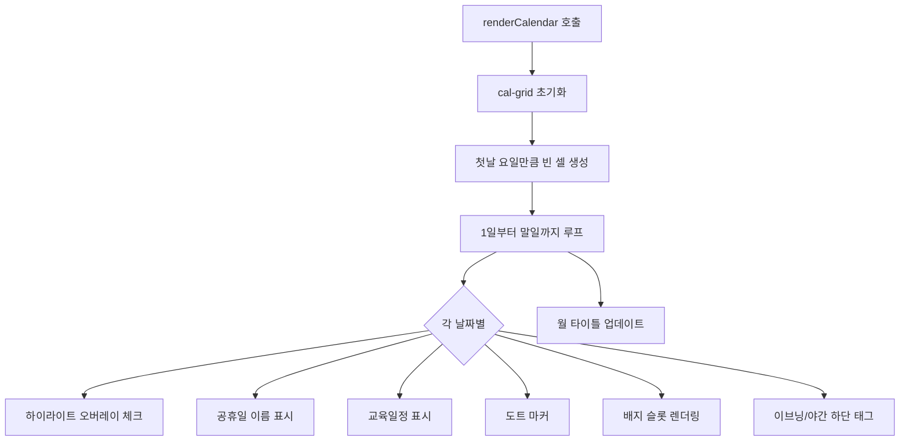

# 📅 공휴일과 달력 로직

## 2026년 공휴일 (HOLIDAYS_2026)

> [!info] 소스 위치
> `index.html` 900~921줄

| 날짜 | 공휴일명 | 빨간날(법정) | 당직 계산 영향 |
|------|----------|:----------:|:----------:|
| 01-01 | 신정 | ✅ | 공휴일 적용 |
| 02-16 | 설날 연휴 | ✅ | 공휴일 적용 |
| 02-17 | 설날 | ✅ | 공휴일 적용 |
| 02-18 | 설날 연휴 | ✅ | 공휴일 적용 |
| 03-01 | 삼일절 | ✅ | 공휴일 적용 |
| 03-02 | 삼일절 대체공휴일 | ❌ 정보만 | 미적용 |
| 05-05 | 어린이날 | ✅ | 공휴일 적용 |
| 05-24 | 부처님오신날 | ✅ | 공휴일 적용 |
| 05-25 | 부처님오신날 대체공휴일 | ❌ 정보만 | 미적용 |
| 06-03 | 지방선거일 | ❌ 정보만 | 미적용 |
| 06-06 | 현충일 | ✅ | 공휴일 적용 |
| 08-15 | 광복절 | ✅ | 공휴일 적용 |
| 08-17 | 광복절 대체공휴일 | ❌ 정보만 | 미적용 |
| 09-24 | 추석 연휴 | ✅ | 공휴일 적용 |
| 09-25 | 추석 | ✅ | 공휴일 적용 |
| 09-26 | 추석 연휴 | ✅ | 공휴일 적용 |
| 10-03 | 개천절 | ✅ | 공휴일 적용 |
| 10-05 | 개천절 대체공휴일 | ❌ 정보만 | 미적용 |
| 10-09 | 한글날 | ✅ | 공휴일 적용 |
| 12-25 | 크리스마스 | ✅ | 공휴일 적용 |

> [!warning] 대체공휴일 주의
> 대체공휴일(`red: false`)은 달력에 이름만 표시되고 **당직 시간 계산에는 영향 없음**.
> 실제로 대체공휴일 적용 여부는 병원 내규에 따라 다를 수 있음.

## 달력 렌더링 로직

### 기본 흐름



### 셀 구조

```
┌─────────────────────┐
│ 5 💬 🔴              │  ← day-header-row (날짜 + 메모아이콘 + 검사아이콘)
│ 어린이날             │  ← holiday-name
│ 📚학술대회            │  ← edu-indicator
│ ●●                   │  ← dots (DOT_MARKERS)
│ ☀종 🌙승             │  ← badge-row (반차)
│ 40:동                │  ← badge-row (40H OFF)
│ 🏝선 🌿석             │  ← badge-row (연차/대휴)
│                      │
│ E:이동현             │  ← evening-tag
│ N:김현석             │  ← night-tag
└─────────────────────┘
```

## DOT_MARKERS (고정 도트)

특정 날짜에 보라색 도트를 표시하는 고정 데이터:

```javascript
const DOT_MARKERS = {
  "2026-03-07": 1, "2026-03-14": 2,
  "2026-03-21": 2, "2026-03-28": 1,
  "2026-04-04": 1, "2026-04-11": 2,
  "2026-04-18": 2, "2026-04-25": 1
};
```

> 도트 1개 or 2개로 표시. 아마 급여일/회의일 등의 고정 일정을 의미하는 것으로 추정.

## 관련 문서

- [[03 - 근무 배정 시스템]] — 하이라이트 색상 규칙
- [[05 - 교육일정 데이터]] — 교육 표시
- [[04 - 장비검사 일정]] — 검사 아이콘 표시
