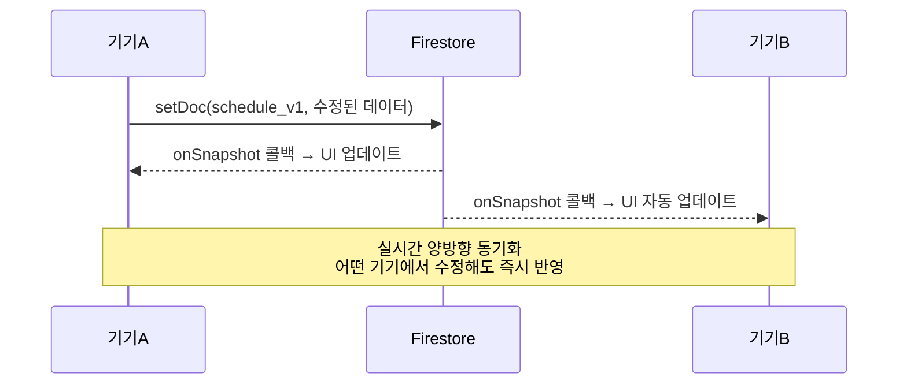

# ☁️ Firebase 설정

> [!info] 소스 위치
> `index.html` 700~746줄 (Firebase 초기화 및 동기화)

## Firebase 프로젝트 정보

| 항목 | 값 |
|------|-----|
| **프로젝트 ID** | `haedong-calendar` |
| **Auth Domain** | `haedong-calendar.firebaseapp.com` |
| **Storage Bucket** | `haedong-calendar.firebasestorage.app` |
| **Messaging Sender ID** | `616171070488` |
| **App ID** | `1:616171070488:web:740f8477651ef103d18f6d` |
| **Firebase SDK** | v10.12.2 (CDN import) |
| **인증 방식** | 익명 인증 (Anonymous) |

## Firestore 구조

```
radiology (컬렉션)
└── schedule_v1 (문서) ← 앱의 모든 데이터가 이 문서 하나에!
    ├── "2026-04-05": { ctmr, night, evening, vacation, ... }
    ├── "2026-04-06": { ... }
    ├── "inspDates": { "2026-04-02_mri-precision": "2026-04-10", ... }
    └── "noticeData": { text: "공지 내용" }
```

### 날짜별 데이터 필드

| 필드명 | 타입 | 예시 | 설명 |
|--------|------|------|------|
| `ctmr` | string | `"종"` | CT/MR 배정 (이니셜) |
| `night` | string | `"이승남"` | 야간당직 (풀네임) |
| `evening` | string | `"김현석"` | 이브닝 (풀네임) |
| `vacation` | string | `"동 강"` | 종일연차 (이니셜, 공백 구분) |
| `half_am` | string | `"선"` | 오전반차 |
| `half_pm` | string | `"승 현"` | 오후반차 |
| `off40` | string | `"봉지진조"` | 40H OFF (이니셜 붙여쓰기도 가능) |
| `alt_leave` | string | `"rest:종 reserve:승"` | 대휴 (사유:이니셜) |
| `memo` | string | `"MRI 점검"` | 사용자 메모 |

### 특수 키

| 키 | 타입 | 설명 |
|----|------|------|
| `inspDates` | object | 장비검사 이동 날짜 매핑 |
| `noticeData` | object | 전체 공지사항 `{ text: "..." }` |

## 보안 규칙

```
// firestore.rules
rules_version = '2';
service cloud.firestore {
  match /databases/{database}/documents {
    match /radiology/{docId} {
      allow read, write: if request.auth != null;
    }
  }
}
```

> [!warning] 보안 수준
> 현재는 **익명 인증된 사용자면 누구나 읽기/쓰기 가능**. 
> PIN 코드는 클라이언트 측 UI 보호일 뿐, Firestore 접근 자체는 제한하지 않음.

## 동기화 흐름



## Sync 상태 표시

네비게이션 바의 `●` 도트로 상태 표시:

| 상태 | 색상 | 의미 |
|------|------|------|
| `online` | 회색 (기본) | 동기화 중 |
| `saving` | 🟡 노랑 | 저장 중... |
| `saved` | 🟢 초록 | 저장 완료 (2초 후 online으로 복귀) |
| `offline` | 회색 | 오프라인 (Firebase 연결 실패) |

## 관련 문서

- [[01 - 아키텍처와 기술스택]]
- [[03 - 근무 배정 시스템]] — 데이터 저장 형식
- [[04 - 장비검사 일정]] — inspDates 구조
